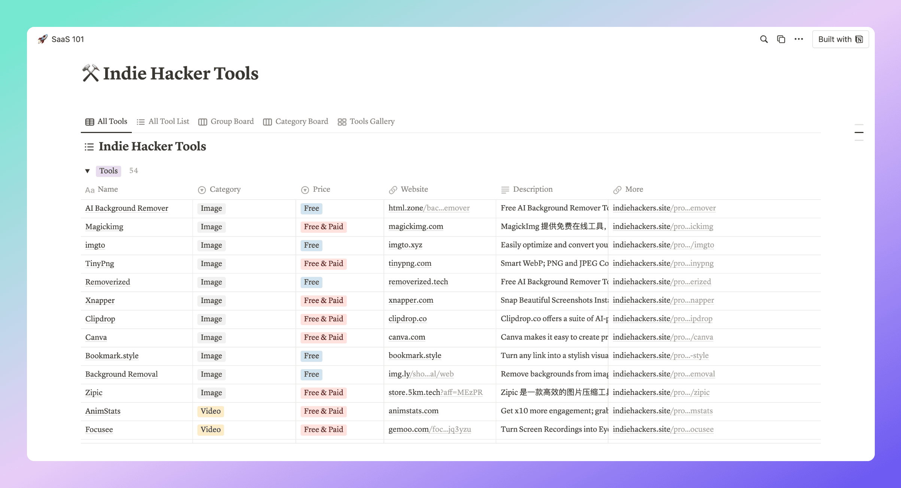
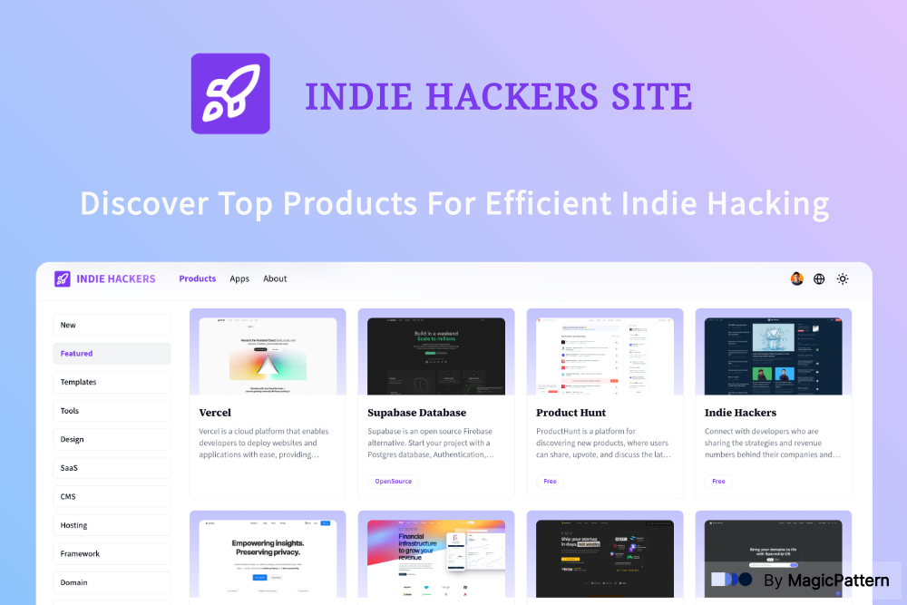

## 🚀 What is Indie Hackers Site data? 

[Indie Hackers Site](https://www.indiehackers.site) is a platform to help indie hackers ship their SaaS Applications Faster and Better by providing you with the best fit products and quick start guides.

[Indie Hackers Site](https://www.indiehackers.site) is not open source for now, but the data of this site is open sourced now, so you can build your own website for indie hackers.

👉 **All Indie Hackers Tools data is saved in file data.csv.**

Files with name like `data_{timestamp}.csv` means data backup files.

## 📂 Data Fields in CSV file 

**1️⃣ Name**: the name of tool, for example: Vercel  
**2️⃣ Group**: the group of tool, for example: Framework  
**3️⃣ Category**: the category of tool, for example: Frontend Framework / Backend Framework  
**4️⃣ Price**: the price of tool, for example: Free / Paid / Free & Paid  
**5️⃣ Website**: the website of tool, for example: https://vercel.com  
**6️⃣ Description**: the simple description of tool, for example: Vercel is a xxx  
**7️⃣ More**: the url link to Indie Hackers Site for this tool, for example: https://www.indiehackers.site/product/vercel  
**8️⃣ Date**: the date when this tool collected, for example: 2024/07/14

## 🌟 What is SaaS 101?

In order to show the Indie Hackers Site data, I made a notion website named [SaaS 101](https://link.indiehackers.site/saas101), where you can view and search all these tools freely.

If you are interested in Indie Hacking, feel free to follow me on [Twitter](https://x.com/javayhu), I'm learning and build in public on [Twitter](https://x.com/javayhu).

## 🚀 What is Indie Hackers Site?

[Indie Hackers Site](https://www.indiehackers.site) is a platform to help indie hackers ship their SaaS Applications Faster and Better by providing you with the best fit products and quick start guides.

