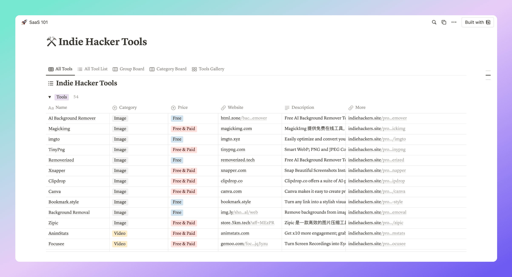

# What is Indie Hackers Site?

Introduction: [indiehackers.site](https://www.indiehackers.site/en/about)

Indie Hackers Site is a platform to help indie hackers ship their SaaS Applications Faster and Better by providing you with the best fit products and quick start guides.

# What is Indie Hackers Site data? 

Indie Hackers Site code is not open source for now, but the data of this site is open sourced now, so you can build your own website for indie hackers.

**All Indie Hackers Tools data is saved in file data_{timestamp}.csv.**

# What is SaaS 101?

In order to show the Indie Hackers Site data, I made a notion website [SaaS 101](https://saas101.notion.site/SaaS-101-d2ae31346a834beea6f458006fc8969e), where you can view and search all tools freely.

